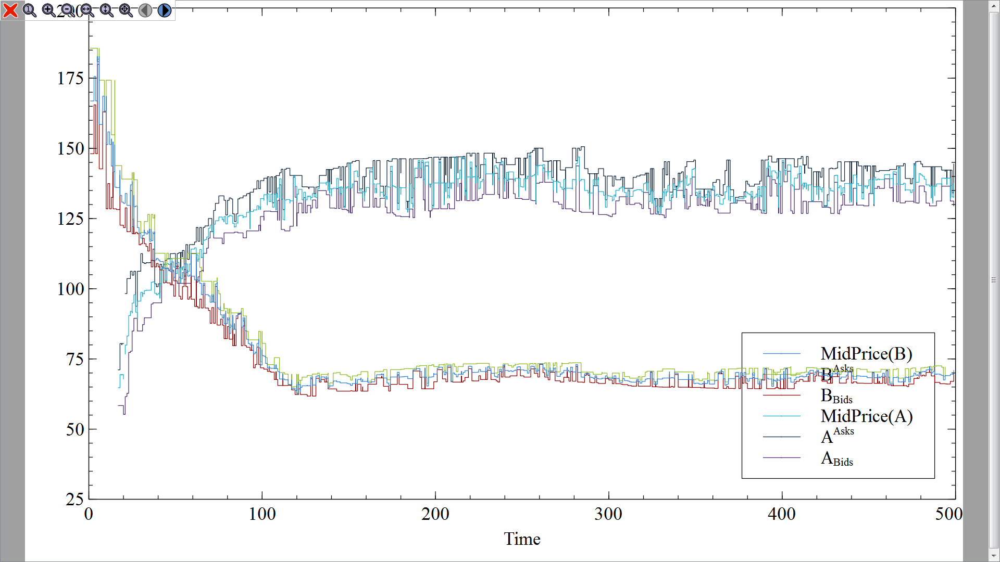

FiQuant Market Microstructure Simulator
=======================================

The project simulates a generic agent based	market model. The aim is to explore intimately, by simulation, the process of price formation and the market microstructure.

Installation
------------

This version of the simulator requires Python 2.7 installed

Following Python packages need to be installed:

- ``blist``: https://pypi.python.org/pypi/blist/
- ``docutils``: https://pypi.python.org/pypi/docutils
- ``numpy``: https://pypi.python.org/pypi/numpy
- ``pandas``: http://pandas.pydata.org/

For running scripts and offline visualisation Veusz package is needed 

- ``Veusz``: http://home.gna.org/veusz/

In order to run the web server you need also Flask package installed:

- ``Flask``: http://flask.pocoo.org/

Normally all these packages can be downloaded and installed using ``pip`` (http://www.pip-installer.org/) or ``easy_install`` (https://pypi.python.org/pypi/setuptools)

Offline usage with Veusz
------------------------

After having downloaded simulator and having installed all packages needed ``VEUSZ_EXE`` environment variable should be assigned to the path to the Veusz executable. Afterwards, sample simulations may be launched: 

.. code-block :: bash

  > cd marketsim/samples
  > python try_dependency.py
  . . . . . . . . . 
  . . . . . . . . . . 
  . . . . . . . . . . 
  . . . . . . . . . . 
  . . . . . . . . . . 
  75509 events processed in 18.849016855s with rate 4005.99143079 event/s
  >
  

