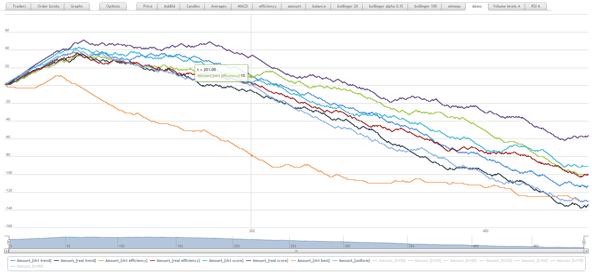
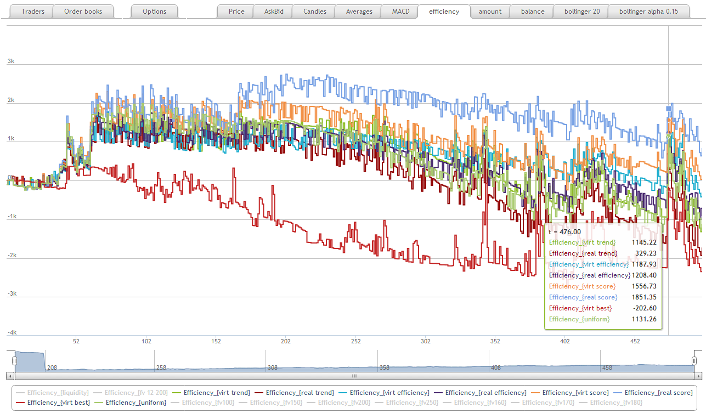

Adaptive strategies
===================

.. contents::
    :local:
    :depth: 2
    :backlinks: none

Adaptive strategies aggregate one or several other strategies and control their execution (e.g. suspending/resuming it) depending on some factors (e.g. efficiency estimation).

Class ``strategy.Suspendable(strategy, predicate)`` wraps ``strategy`` and passes its orders further only if the observable ``predicate`` evaluates to true.

There are many ways to estimate a strategy efficiency. First, we need to associate with a strategy some kind of an account to track position and balance changes induced by the strategy's trades. Second, given an account we may evaluate the strategy's efficiency.

At the moment there are two ways to track strategy position and balance changes:

- **Virtual market order account** (``strategy.adaptive.VirtualMarket`` class) listens orders issued by the strategy and for every order makes a request to the orderbook in order to estimate impact of trades produced by the order. At the moment correct estimation is done only for market orders (``request.EvalMarketOrder`` is used) but order impact is estimated even if the strategy is suspended.

- **Actually traded account** (``strategy.adaptive.ActuallyTraded`` class) listens to ``on_traded`` event of the strategy's trader and collects position and balance change produced by orders of this strategy. It allows to track impact of orders of any type but doesn't take into account orders issued by a suspended strategy.

Strategy efficiency can be estimated in different ways:

- **Efficiency**: "cleared" trader's balance ``eff = observable.Efficiency(strategy.adaptive.VirtualMarket(aStrategy))``

- **Efficiency trend**: first derivative of some moving average of the trader's efficiency ``ops.derivative(EWMA(eff, alpha))``

- **Efficiency movements**: difference between the efficiency and its lagged value ``eff - Lagged(eff, timeframe)``

- **Scoring**: counting positive and negative movements of the effiency

Trade-if-profitable strategy
----------------------------

Suspends an aggregated strategy if its effiency is estimated negatively. By default, it uses ``strategy.adaptive.VirtualMarket`` as strategy tracking account and efficiency trend as efficiency evaluator:

.. code-block:: haskell

    TradeIfProfitable(strategy, 
                      account  = adaptive.virtualMarket, 
                      performance = weight.efficiencyTrend) ::=
                      
        efficiency = performance(account(strategy)) in
        Suspendable(strategy, efficiency >= 0)

.. image:: Figures/web/tradeifprofitable.png

Choose-the-best strategy
------------------------

This strategy aggregates an array of strategies and estimates their efficiencies. At some moments of time it chooses a strategy with the best performance and suspends others. 

.. image:: Figures/web/choosethebest.png

Multiarmed bandit strategy
--------------------------

This strategy stores a weight for each aggregated strategy and regularly updates it. Then it normilizes somehow the weights in order to choose randomly a strategy. Choose-the-best strategy can be considered as a particular case of the multiarmed bandit where the weight is equal performance estimation of a strategy and normalization changes weight of the best strategy to 1 and weights of other strategies are set to 0. 

Multiarmed bandit has following parameters:

- ``strategies`` -- array of strategies to aggregate

- ``account`` -- function that creates an account tracking strategy's trades (``adaptive.VirtualMarket`` or ``adaptive.ActuallyTraded``)

- ``weight`` -- function calculating unnormalized weight of a strategy (like in trade-if-profitable or choose-the-best strategies)

- ``normalizer`` -- function that transforms unnormalized weight (for example, to suit a certain range)

- ``corrector`` -- function that takes an array of weights and makes their sum equal to 1

In the following figures position and efficiency of multiarmed bandit strategies with different combination of these parameters are shown

