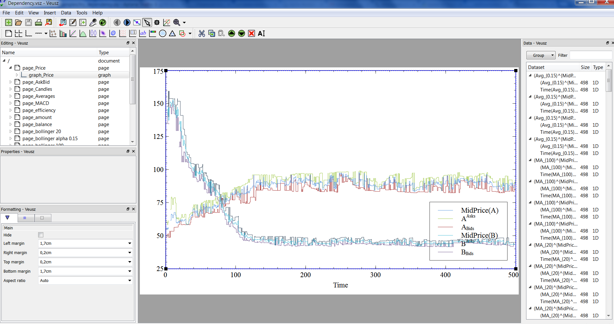

Installation
============

For the moment the simulator has two user interfaces:

- **Web**. A user runs a simulation server and uses a web interface to set up model parameters and run the simulation.
- **Veusz**. A user edits script files describing a simulation, run a simulator and the results are rendered using Veusz software (in principle, it quite easy to plug in another means of visualization).

The first approach is easier for new users while the latter one gives more control over simulation.

.. contents::
    :local:
    :depth: 2
    :backlinks: none

Installing Scala
----------------

The simulator uses a code generated by a translator from Strategy Definition Language. This translator is implemented in Scala progamming language. This language was chosen since it contains functional programming features like pattern-matching and variant types that facilitate the compiler developement but on other hand it is the most "mainstream" language of this kind (which implies existance of a wide developer community and mature tools).

The easiest way to install Scala is to install Simple Build Tool (SBT) from http://www.scala-sbt.org/release/docs/Getting-Started/Setup.html

At Ubuntu SBT may be installed in the following way:

.. code-block:: bash

    wget http://apt.typesafe.com/repo-deb-build-0002.deb
    sudo dpkg -i repo-deb-build-0002.deb
    sudo apt-get update
    sudo apt-get install sbt

After having installed SBT you may check does it work by typing ``sbt run`` in ``$(MARKETSIM_PATH)/marketsim/gen`` directory. This will download Scala 2.10 distribution and additional packages. If everything is fine ``sbt run`` repeated one more time will print something like: 

.. code-block::

    parsing...done
    building name tables...
    	removing anonymous packages
    	injecting base packages
    	removing abstract packages
    	applying before typing annotations
    done
    typing...done
    generating python code...done

Note that installing Scala is required only if strategy descriptions are going to be edited.

Steps common for Veusz and Web interfaces
-----------------------------------------

Latest public version of the simulator can be downloaded from  https://github.com/fiquant/marketsimulator/releases

This version of the simulator requires Python 2.7 installed: http://www.python.org/download/

Following Python packages need to be installed:

- ``blist``: https://pypi.python.org/pypi/blist/
- ``docutils``: https://pypi.python.org/pypi/docutils (only needed to run Web server)
- ``numpy``: https://pypi.python.org/pypi/numpy (only needed for ``strategy.MultiArmedBandit``)
- ``pandas``: http://pandas.pydata.org/ (only needed for ``Quotes`` at the moment)

Normally all these packages can be downloaded and installed using ``pip`` (http://www.pip-installer.org/) or ``easy_install`` (https://pypi.python.org/pypi/setuptools)

Running a Web-server with online interface
------------------------------------------

In order to run the web server you need ``Flask`` package installed: http://flask.pocoo.org/

``wsgi/flaskapp.py`` launches the Web server at default port 80:

.. code-block :: bash

  > cd wsgi
  > python flaskapp.py
   * Running on http://127.0.0.1:80/
   
After that you may open ``localhost`` page in your Web browser:

.. image:: Figures/web/traders.png

Press **Run** button to launch the simulation:

.. image:: Figures/web/volume-levels.png

Offline usage with Veusz
------------------------

For running scripts and offline visualisation ``Veusz`` package is needed: http://home.gna.org/veusz/. After having it installed ``VEUSZ_EXE`` environment variable should be assigned to the path to the Veusz executable. Afterwards, sample simulations may be launched: 

.. code-block :: bash

  > cd marketsim/samples
  > python try_dependency.py
  . . . . . . . . . 
  . . . . . . . . . . 
  . . . . . . . . . . 
  . . . . . . . . . . 
  . . . . . . . . . . 
  75509 events processed in 18.849016855s with rate 4005.99143079 event/s
  >
  

