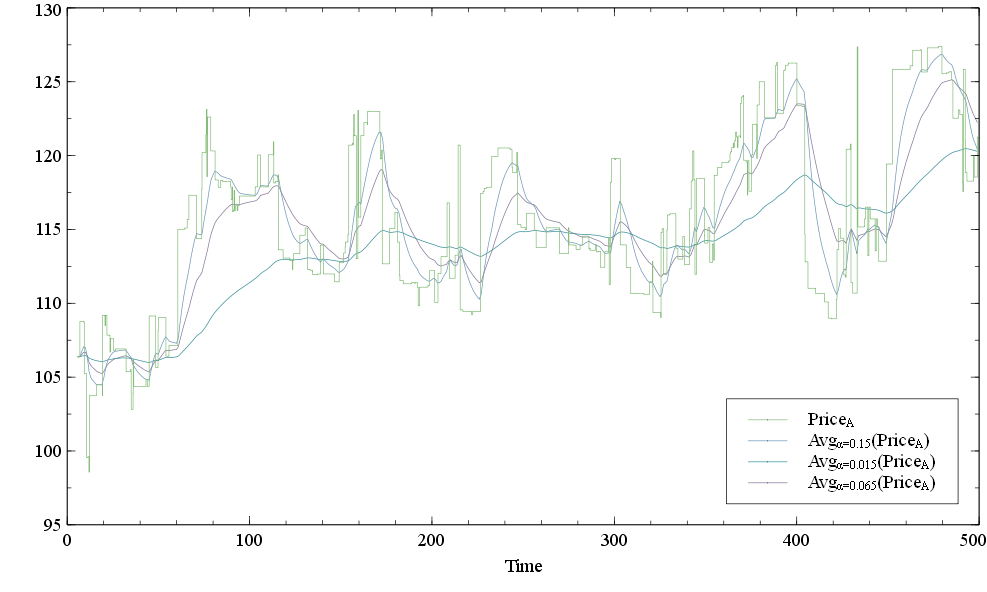
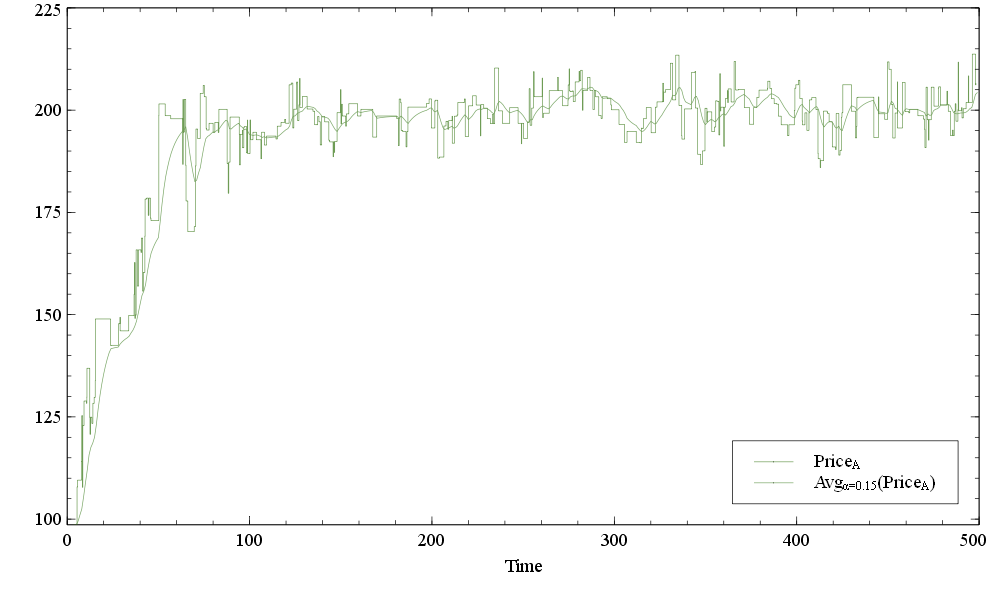
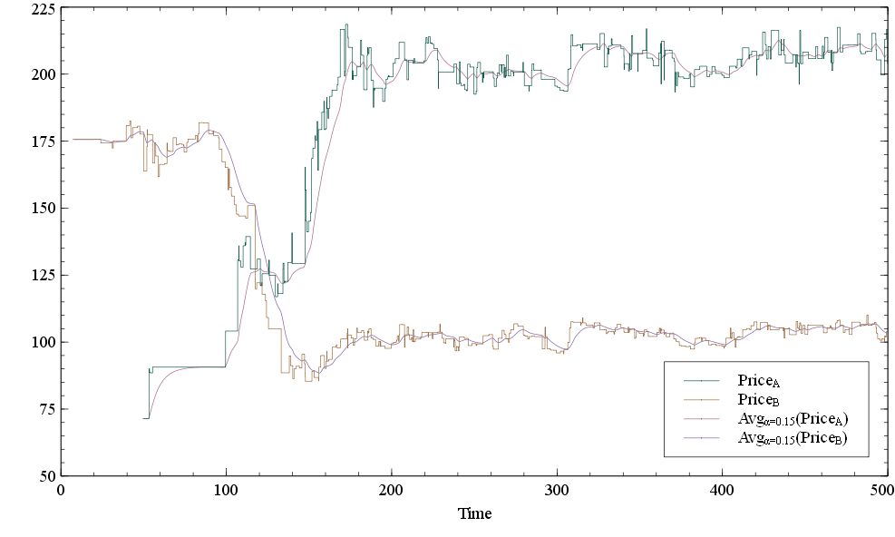
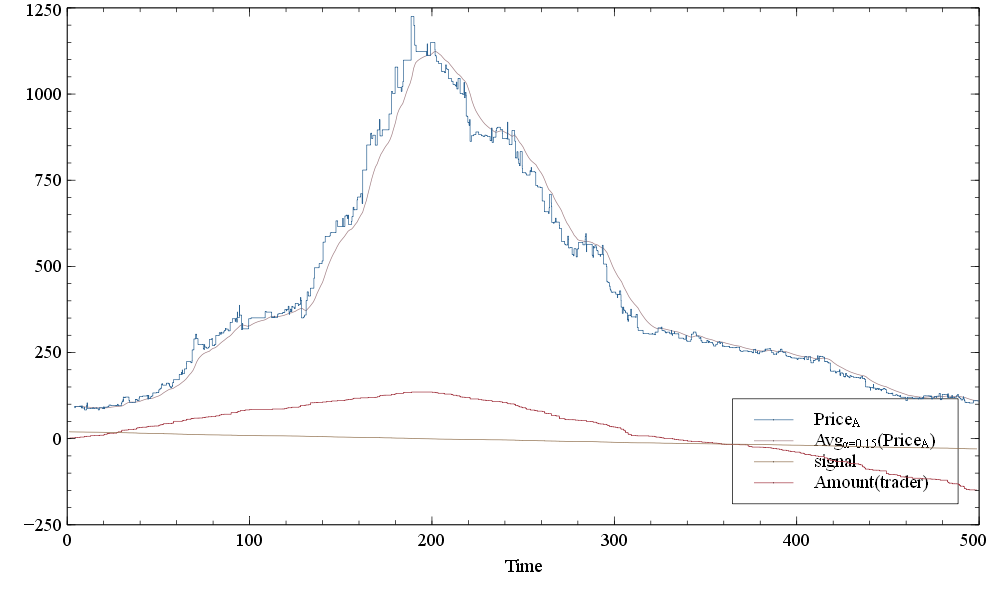
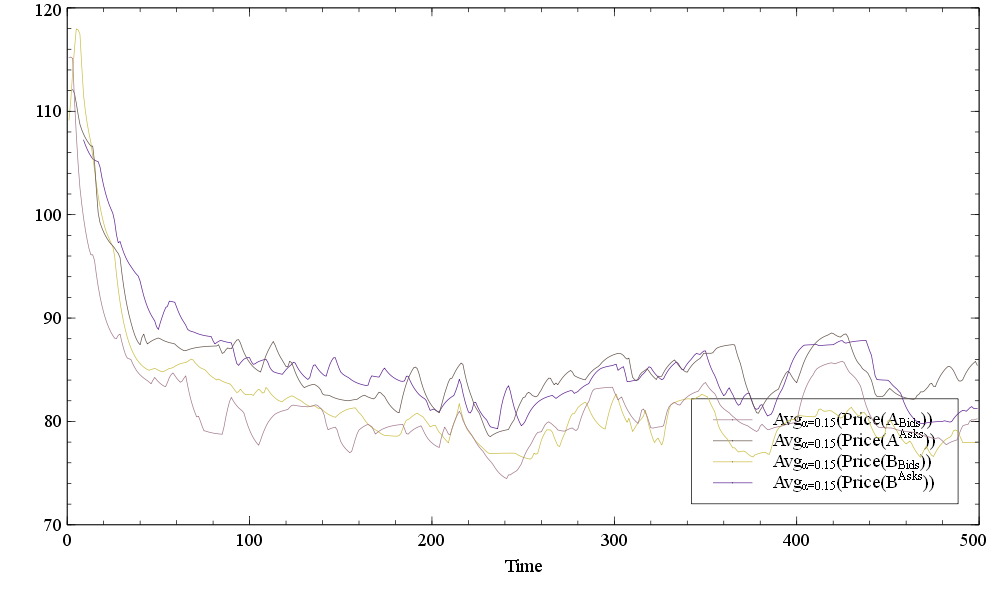
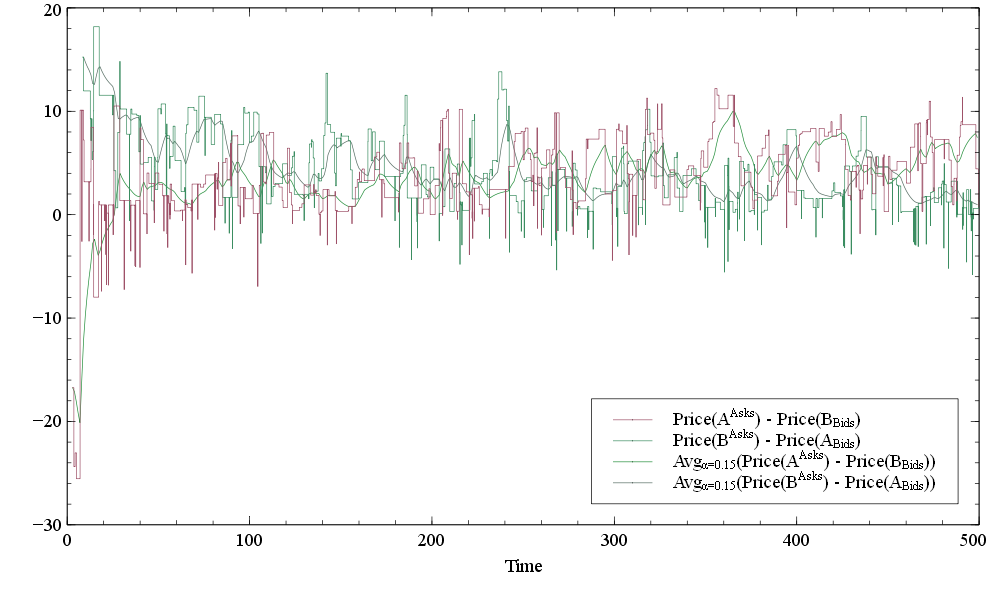

Introduction
============

Marketsim is a library for market microstructure simulation. It allows
to instantiate a number of traders behaving according to various
strategies and simulate their trade over number of assets. For the
moment information gathered during simulation is reported in form of
graphs.

This library is a result of rewriting Marketsimulator library developed
in Ecole Centrale de Paris into Python. Python language was chosen as
basic language for development due to its expressiveness, interactivity
and availability of free high quality libraries for scientific
computing. From another hand, programs in Python are not very fast and a
translator from Python Marketsim object model into a C++ class templates
simulation library can be developed in order to achieve maximal possible
performance for simulations.

The library source can be found at
http://marketsimulator.svn.sourceforge.net/viewvc/marketsimulator/DevAnton/v3/.
It requires Python >= 2.6 installed. For graph plotting free plotting
software is needed (http://home.gna.org/veusz/downloads/). After
installation please specify path to the Veusz executable (including
executable filename) in environment variable. needs free package to be
installed: http://pypi.python.org/pypi/blist/.

Discrete event simulation components
====================================

Main class for every discrete event simulation system is a scheduler
that maintains a set of actions to fulfill in future and launches them
according their action times: from older ones to newer. Normally
schedulers are implemented as some kind of a heap data structure in
order to perform frequent operations very fast. Classical heap allows
inserts into at O(logN), extracting the best element at O(logN) and
accessing to the best element at O(1).

Scheduler
---------

Scheduler class provides following interface:

::

    class Scheduler(object):
        def reset(self)
        def currentTime(self)
        def schedule(self, actionTime, handler)
        def scheduleAfter(self, dt, handler)
        def workTill(self, limitTime)
        def advance(self, dt)

In order to schedule an event a user should use or methods passing there
an event handler which should be given as a callable object (a function,
a method, lambda expression or a object exposing method). These
functions return a callable object which can be called in order to
cancel the scheduled event.

Methods and advance model time calling event handlers in order of their
action times. If two events have same action time it is garanteed that
the event scheduled first will be executed first. These methods must not
be called from an event handler. In such a case an exception will be
issued.

Since a scheduler is supposed to be single for non-parallel simulations,
for convenient use from other parts of the library static class is
introduced which grants access to , and methods of the unique scheduler.
This scheduler should be initialized by creating an instance of class in
client code ( method) and it gives right to manage simulation by calling
and methods.

Timer
-----

It is a convenience class designed to represent some repeating action.
It has following interface:

::

    class Timer(object):
        def __init__(self, intervalFunc):
            self.on_timer = Event()
            ...
        def advise(self, listener):
            self.on_timer += listener

It is initialized by a function defining interval of time to the next
event invocation. Event handler to be invoked should be passed to method
(there can be multiple listeners).

For example, sample path a Poisson process with :math:`\lambda`\ =1 can
be obtained in the following way:

::

    import random
    from marketsim.scheduler import Timer, world

    def F(timer):
        print world.currentTime
        
    Timer(lambda: random.expovariate(1.)).advise(F)

    world.advance(20)

will print

::

    0.313908407622
    0.795173273046
    1.50151801647
    3.52280681834
    6.30719707516
    8.48277712333

Note that is designed to be an event source and for previous example
there is a more convenient shortcut:

::

    world.process(lambda: random.expovariate(1.), F)

Orders
======

Traders send orders to a market. There are two basic kinds of orders:

-  Market orders that ask to buy or sell some asset at any price.

-  Limit orders that ask to buy or sell some asset at price better than
   some limit price. If a limit order is not competely fulfilled it
   remains in an order book waiting to be matched with another order.

An order book processes market and limit orders but keeps persistently
only limit orders. Limit orders can be cancelled by sending cancel
orders. From trader point of view there can be other order types like
Iceberg order but from order book perspective it is just a sequence of
basic orders: market or limit ones.

Basic order functionality
-------------------------

Orders to buy or sell some assets should derive from which provides
basic functionality. It has following user interface:

::

    class OrderBase(object):
        def __init__(self, volume):
            self.on_matched = Event()
            ...
        def volume(self)
        def PnL(self)
        def empty(self)
        def cancelled(self)
        def cancel(self)
        side = Side.Buy | Side.Sell

It stores number of assets to trade (), calculates P&L for this order
(positive if it is a sell order and negative if it is a buy order) and
keeps a cancellation flag. An order is considered as empty if its volume
is equal to 0. When order is matched (partially or completely) event
listeners are invoked with information what orders are matched, at what
price and what volume with.

Usually the library provides a generic class for an order that accepts
in its constructor side of the order. Also, that class provides and
static methods that create orders with fixed side. For convenience, a
method to call the constructor in curried form is also provided ()

::

        # from marketsim.order.Market class definition 
        @staticmethod
        def Buy(volume): return Market(Side.Buy, volume)
        
        @staticmethod
        def Sell(volume): return Market(Side.Sell, volume)
        
        @staticmethod
        def T(side): return lambda volume: Market(side, volume)

Market orders
-------------

Market order ( class) derives from and simply add some logic how it
should be processed in an order book.

Limit orders
------------

Limit order ( class) stores also its limit price and has a bit more
complicated logic of processing in an order book.

Iceberg orders
--------------

Iceberg orders ( class) are virtual orders (so they are composed as a
sequence of basic orders) and are never stored in order books. Once an
iceberg order is sent to an order book, it creates an order of
underlying type with volume constrained by some limit and sends it to
the order book instead of itself. Once the underlying order is matched
completely, the iceberg order resends another order to the order book
till all iceberg order volume will be traded.

Iceberg orders are created by the following function in curried form:

::

    def iceberg(volumeLimit, orderFactory):
        def inner(*args):
            return Iceberg(volumeLimit, orderFactory, *args)
        return inner

where is a maximal volume of an order that can be issued by the iceberg
order and is a factory to create underlying orders like or and are
parameters to be passed to order’s initializer.

Cancel orders
-------------

Cancel orders ( class) are aimed to cancel already issued limit (and
possibly iceberg) orders. If a user wants to cancel she should send to
the same order book. It will notify the order book event listeners if
the best order in the book has changed. Also, event is fired.

Limit market orders
-------------------

Limit market order ( class) is a virtual order which is composed of a
limit order and a cancel order sent immediately after the limit one thus
combining behavior of market and limit orders: the trade is done at
price better than given one (limit order behavior) but in case of
failure the limit order is not stored in the order book (market order
behavior). This class also has optional parameter which, when given,
instructs to store the limit order for this delay (Should it be
extracted into a separate Cancellable virtual order which should be
parametrized by an order to cancel – it might be a limit order, an
iceberg or an always best order???).

Always best orders
------------------

Always best order ( class) is a virtual order that ensures that it has
the best price in the order book. It is implemented as a limit order
which is cancelled once the best price in the order queue has changed
and is sent again to the order book with a price one tick better than
the best price in the book. If several always best orders are sent to
one side of an order book, a price race will start thus leading to their
elimination by orders of the other side.

Virtual market orders
---------------------

Virtual market orders ( class) are utilitary orders that are used to
evaluate a P&L of a market order without submitting it. These orders
don’t make any influence onto the market and end with call to method.
When the P&L is evaluated, event is fired with parameters

Order book and order queue
==========================

Order book represents a single asset traded in some market. Same asset
traded in different markets would have been represented by different
order books. An order book stores unfulfilled limit orders sent for this
asset in two order queues, one for each trade sides (Asks for sell
orders and Bids for buy orders).

Order queues are organized in a way to extract quickly the best order
and to place a new order inside. In order to achieve this a heap based
implementation is used.

Order books support a notion of a tick size: all limit orders stored in
the book should have prices that are multipliers of the chosen tick
size. If an order has a limit price not divisible by the tick size it is
rounded to the closest ’weaker’ tick (’floored’ for buy orders and
’ceiled’ for sell orders).

Market orders are processed by an order book in the following way: if
there are unfulfilled limit orders at the opposite trade side, the
market order is matched against them till either it is fulfilled or
there are no more unfilled limit orders. Price for the trade is taken as
the limit order limit price. Limit orders are matched in order of their
price (ascending for sell orders and descending for buy orders). If two
orders have the same price, it is garanteed that the elder order will be
matched first.

Limit orders firstly processed exactly as market orders. If a limit
order is not filled completely it is stored in a corresponding order
queue.

There is a notion of transaction costs: if a user wants to define
functions computing transaction fees for market, limit and cancel orders
she should pass functions of form to the order book constructor. If is
negative, the trader gains some money on this transaction. If the
functions are given, once an order is processed by an order book, method
is called. The default implementation for the method delegates it to
where is a trader associated with the .

Order book
----------

For the moment, there are two kinds of order books: local and remote
ones. Local order books execute methods immediately but remote onces try
to simulate some delay between a trader and a market by means of message
passing (so they are asynchronous by their nature). These books try to
have the same interface in order that traders cannot tell the difference
between them.

The base class for the order books is:

::

    class orderbook._base.BookBase(object):
        def __init__(self, tickSize=1, label="")
        def queue(self, side)
        def tickSize(self)
        def process(self, order)
        def bids(self)
        def asks(self)
        def price(self)
        def spread(self)
        def evaluateOrderPriceAsync(self, side, volume, callback)

Methods , and give access to queues composing the order book. Methods
and return middle arithmetic price and spread if they are defined (i.e.
bids and asks are not empty). Orders are handled by an order book by
method. If method is called recursively (e.g. from a listener of event)
its order is put into an internal queue which is to be processed when
the current order processing is finished. This ensures that at every
moment of time only one order is processed. Method is used to compute
P&L of a market order of given side and volume without executing it.
Since this operation might be expensive to be computed locally in case
of a remote order book we return the result price asynchronously by
calling function given by parameter.

Local order book
----------------

Local order books extend the base order book by concrete order
processing implementation (methods , etc.) and allow user to define
functions computing transaction fees:

::

    class orderbook.Local(BookBase):
        """ Order book for a single asset in a market
        Maintains two order queues for orders of different sides
        """
        def __init__(self, tickSize=1, label="",
                     marketOrderFee = None,
                     limitOrderFee = None,
                     cancelOrderFee = None)

Order queue
-----------

Order queues can be accessed via , and methods of an order book and
provide following user interface:

::

    class orderbook._queue.Queue(object):
        def __init__(self, ...):
            # event to be called when the best order changes
            self.on_best_changed = Event()  
            # event (orderQueue, cancelledOrder) to be called when an order is cancelled
            self.on_order_cancelled = Event() 

        def book(self)
        def empty(self)
        def best(self)
        def withPricesBetterThan(self, limit)
        def volumeWithPriceBetterThan(self, limit)
        def sorted(self)
        def sortedPVs(self) 

The best order in a queue can be obtained by calling method provided
that the queue is not . Method enumerates orders having limit price
better or equal to . This function is used to obtain total volume of
orders that can be traded on price better or equal to the given one: .
Property enumerates orders in their limit price order. Property
enumerates aggregate volumes for each price in the queue in their order.

When the best order changes in a queue (a new order arrival or the best
order has matched), event listeners get notified.

Remote order book
-----------------

Remote order book ( class) represents an order book for a remote trader.
Remoteness means that there is some delay between moment when an order
is sent to a market and the moment when the order is received by the
market so it models latency in telecommunication networks. A remote book
constructor accepts a reference to an actual order book (or to another
remote order book) and a reference to a two-way communication channel.
Class implements a two-way telecommunication channel having different
latency functions in each direction (to market and from market). It also
ensures that messages are delivired to the recipient in the order they
were sent. Queues in a remote book are instances of class. This class is
connected to the real order queue and listens events thus keeping
information about the best order in the queue up-to-date. When a remote
order book receives an order, it is cloned and sent to the actual order
book via communication link. The remote order book gets subscribed to
the clone order’s events via downside link. It leads to that in some
moments of time the state of the original order and its clone are not
synchronised (and this is normal).

Traders
=======

Trader functionality can be divided into the following parts:

-  Ability to send orders to the market

-  Tracking number of assets traded and current P&L

-  Managing number of assets and money that can be involved into trade
   (currently, a trader may send as many orders as it wishes; in future,
   when modelling money management there should be some limitations on
   how many resources it may use)

-  Logic for determining moments of time when orders should to be sent
   and their parameters.

In our library trading strategy classes encapsulate trader behaviour
(the last point) while trader classes are responsible for resource
management (first three points).

Class provides basic functionality for all traders: P&L bookkeeping (
method) and notifying listeners about two events: when a new order is
sent to market and when an order sent to market partially or completely
fulfilled.

Class derives from and adds tracking of a number of assets traded (
property).

Class derives from and associates with a specific order book where
orders are to be sent. Class stores references to a collection of order
books where the trader can trade.

Class can be used to measure trader "efficiency" i.e. trader’s balance
if it were "cleared" (if the trader bought missing assets or sold the
excess ones by sending a market order for assets).

Strategies
==========

Strategy base classes
---------------------

All strategies should derive from class. This class keeps flag and
stores a reference to a trader for the strategy.

::

    class Strategy(object):
        
        def __init__(self, trader):
            self._suspended = False
            self._trader = trader
            
        @property
        def suspended(self):
            return self._suspended
        
        def suspend(self, s):
            self._suspended = s
            
        @property
        def trader(self):
            return self._trader

Generic one side strategy
~~~~~~~~~~~~~~~~~~~~~~~~~

Class derives from and provides generic structure for creating
strategies that trade only at one side. It is parametrized by following
data:

-  Trader.

-  Side of the trader.

-  Event source. It is an object having method that allows to start
   listening some events. Typical examples of event sources are timer
   events or an event that the best price in an order queue has changed.
   Of course, possible choices of event sources are not limited to these
   examples.

-  Function to calculate parameters of an order to create. For limit
   orders it should return pair and for market orders it should return a
   1-tuple . This function has one parameter - which can be requested
   for example for its current P&L and about amount of the asset being
   traded.

-  Factory to create orders that will be used as a function in curried
   form where is type of return value of the function calculating order
   parameters. Typical values for this factory are , or, for exalmple, .

The strategy wakes up in moments of time given by the event source,
calculates parameters of an order to create, creates an order and sends
it to the order book.

Generic two side strategy
~~~~~~~~~~~~~~~~~~~~~~~~~

Class derives from and provides generic structure for creating traders
that trade on both sides. It is parametrized by following data (see also
parameters):

-  Trader.

-  Event source. It is an object having method that allows to start
   listening some events.

-  Function to calculate parameters of an order to create. It should
   return either pair if it wants to create an order, or if no order
   should be created.

-  Factory to create orders that will be used as a function in curried
   form where is type of return value of the function calculating order
   parameters.

The strategy wakes up in moments of time given by the event source,
calculates parameters and side of an order to create, if the side is
defined creates an order and sends it to the order book.

Concrete strategies
-------------------

Liquidity provider
~~~~~~~~~~~~~~~~~~

Liquidity provider ( class) strategy is implemented as instance of . It
has followng parameters:

-  - strategy’s trader

-  - side of orders to create (default: )

-  - order factory function (default: )

-  - initial price which is taken if is empty (default: 100)

-  - defines intervals of time between order creation (default:
   exponential distribution with :math:`\lambda`\ =1)

-  - defines multipliers for current asset price when price of order to
   create is calculated (default: log normal distribution with
   :math:`\mu`\ =0 and :math:`\sigma`\ =0.1)

-  - defines volumes of orders to create (default: exponential
   distribution with :math:`\lambda`\ =1)

It wakes up in moments of time given by , checks the last best price of
orders in the corresponding queue, takes if it is empty, multiplies it
by a value taken from to obtain price of the order to create, calculates
order volume using , creates an order via and tells the trader to send
it.

For convenience, there is a function that creates two liquidity
providers with same parameters except but of two different trading
sides.

[htbp] |Liquidity provider sample run| [fig:LiquidityProvider]

Sample usage:

::

    from marketsim.veusz_graph import Graph, showGraphs
    import random
    from marketsim import strategy, trader, orderbook, scheduler, observable

    world = scheduler.create()

    avg = observable.avg
    book_A = orderbook.Local(tickSize=0.01, label="A")

    price_graph = Graph("Price")
     
    assetPrice = observable.Price(book_A)

    price_graph.addTimeSeries([\
        assetPrice,
        avg(assetPrice, alpha=0.15),
        avg(assetPrice, alpha=0.015),
        avg(assetPrice, alpha=0.65)])

    def volume(v):
        return lambda: v*random.expovariate(.1)

    lp_A = strategy.LiquidityProvider(\
            trader.SASM(book_A, "A"), volumeDistr=volume(10)).trader
    lp_a = strategy.LiquidityProvider(\
            trader.SASM(book_A, "a"), volumeDistr=volume(1)).trader

    spread_graph = Graph("Bid-Ask Spread")

    spread_graph.addTimeSerie(observable.BidPrice(book_A))
    spread_graph.addTimeSerie(observable.AskPrice(book_A))

    eff_graph = Graph("efficiency")
    eff_graph.addTimeSerie(observable.Efficiency(lp_a))
    eff_graph.addTimeSerie(observable.PnL(lp_a))

    world.workTill(500)

    showGraphs("liquidity", [price_graph, spread_graph, eff_graph])

Canceller
~~~~~~~~~

is an agent aimed to cancel persistent (limit, iceberg etc.) orders
issued by a trader. In order to do that it subscribes to event of the
trader, stores incoming orders in an array and in some moments of time
chooses randomly an order and cancels it by sending .

It has following parameters:

-  - trader to subscribe to

-  - intervals of times between order cancellations (default:
   exponential distribution with :math:`\lambda`\ =1)

-  - function N -> idx that chooses which order should be cancelled

Fundamental value strategy
~~~~~~~~~~~~~~~~~~~~~~~~~~

Fundamental value strategy ( class) believes that an asset should cost
some specific price (’fundamental value’) and if current asset price is
lower than fundamental value it starts to buy the asset and if the price
is higher than it starts to sell the asset. It has following parameters:

-  -strategy’s trader

-  - order factory function (default: )

-  - defines intervals of time between order creation (default:
   exponential distribution with :math:`\lambda`\ =1)

-  - defines fundamental value (default: constant 100)

-  - defines volumes of orders to create (default: exponential
   distribution with :math:`\lambda`\ =1)

[htbp] |Fundamental value trader sample run (fv=200)| [fig:FVTrader]

Sample usage:

::

    from marketsim.veusz_graph import Graph, showGraphs
    from marketsim import strategy, orderbook, trader, scheduler, observable

    world = scheduler.create()

    book_A = orderbook.Local(tickSize=0.01, label="A")

    price_graph = Graph("Price")
     
    assetPrice = observable.Price(book_A)
    price_graph.addTimeSerie(assetPrice)

    avg = observable.avg
    trend = observable.trend

    price_graph.addTimeSerie(avg(assetPrice))

    lp_A = strategy.LiquidityProvider(trader.SASM(book_A), volumeDistr=lambda: 70).trader

    trader_200 = strategy.FundamentalValue(trader.SASM(book_A, "t200"),\
                    fundamentalValue=lambda: 200., volumeDistr=lambda: 12).trader
    trader_150 = strategy.FundamentalValue(trader.SASM(book_A, "t150"), \
                    fundamentalValue=lambda: 150., volumeDistr=lambda: 1).trader

    eff_graph = Graph("efficiency")
    trend_graph = Graph("efficiency trend")
    pnl_graph = Graph("P&L")
    volume_graph = Graph("volume")

    def addToGraph(traders):
        for t in traders:
            e = observable.Efficiency(t)
            eff_graph.addTimeSerie(avg(e))
            trend_graph.addTimeSerie(trend(e))
            pnl_graph.addTimeSerie(observable.PnL(t))
            volume_graph.addTimeSerie(observable.VolumeTraded(t))

    addToGraph([trader_150, trader_200])

    world.workTill(1500)

    showGraphs("fv_trader", [price_graph, eff_graph, trend_graph, pnl_graph, volume_graph])

Dependent price strategy
~~~~~~~~~~~~~~~~~~~~~~~~

Dependent price strategy ( class) believes that the fair price of an
asset *A* is completely correlated with price of another asset *B* and
the following relation should be held: *:math:`Price_{A}` =
:math:`kPrice_B`*, where *k* is some factor. It may be considered as a
variety of a fundamental value strategy with the exception that it is
invoked every the time price of another asset *B* has changed. It has
following parameters:

-  -strategy’s trader

-  - asset that is considered as a reference one

-  - order factory function (default: )

-  - multiplier to obtain fair asset price from the reference asset
   price

-  - defines volumes of orders to create (default: exponential
   distribution with :math:`\lambda`\ =1)

[htbp] |Dependency trader sample run (k=0.5)| [fig:Dependency]

Sample usage:

::

    from marketsim.veusz_graph import Graph, showGraphs
    import random

    from marketsim import strategy, orderbook, trader, scheduler, observable

    world = scheduler.create()

    book_A = orderbook.Local(tickSize=0.01, label="A")
    book_B = orderbook.Local(tickSize=0.01, label="B")

    price_graph = Graph("Price")
     
    assetPrice_A = observable.Price(book_A)
    price_graph.addTimeSerie(assetPrice_A)

    assetPrice_B = observable.Price(book_B)
    price_graph.addTimeSerie(assetPrice_B)

    avg = observable.avg

    price_graph.addTimeSerie(avg(assetPrice_A, alpha=0.15))
    price_graph.addTimeSerie(avg(assetPrice_B, alpha=0.15))

    liqVol = lambda: random.expovariate(.1)*5
    lp_A = strategy.LiquidityProvider(trader.SASM(book_A), \
                     defaultValue=50., volumeDistr=liqVol).trader
    lp_B = strategy.LiquidityProvider(trader.SASM(book_B), \
                     defaultValue=150., volumeDistr=liqVol).trader

    dep_AB = strategy.Dependency(trader.SASM(book_A, "AB"), book_B, factor=2).trader
    dep_BA = strategy.Dependency(trader.SASM(book_B, "BA"), book_A, factor=.5).trader

    eff_graph = Graph("efficiency")
    eff_graph.addTimeSerie(observable.Efficiency(dep_AB))
    eff_graph.addTimeSerie(observable.Efficiency(dep_BA))
    eff_graph.addTimeSerie(observable.PnL(dep_AB))
    eff_graph.addTimeSerie(observable.PnL(dep_BA))

    world.workTill(500)

    showGraphs("dependency", [price_graph, eff_graph])

Noise strategy
~~~~~~~~~~~~~~

Noise strategy ( class) is quite dummy strategy that randomly creates an
order and sends it to the order book. It has following parameters:

-  -strategy’s trader

-  - order factory function (default: )

-  - defines intervals of time between order creation (default:
   exponential distribution with :math:`\lambda`\ =1)

-  - side of orders to create (default: discrete uniform distribution
   P(Sell)=P(Buy)=.5)

-  - defines volumes of orders to create (default: exponential
   distribution with :math:`\lambda`\ =1)

Signal strategy
~~~~~~~~~~~~~~~

Signal strategy ( class) listens to some discrete signal and when the
signal becomes more than some the strategy starts to buy. When the
signal gets lower than the strategy starts to sell. It has following
parameters:

-  -strategy’s trader

-  - signal to be listened to

-  - order factory function (default: )

-  - threshold when the trader starts to act (default: 0.7)

-  - defines volumes of orders to create (default: exponential
   distribution with :math:`\lambda`\ =1)

[htbp] |Signal trader sample run (signal=20-t/10)| [fig:Signalr]

Sample usage:

::

    from marketsim.veusz_graph import Graph, showGraphs
    from marketsim import signal, strategy, trader, orderbook, scheduler, observable

    world = scheduler.create()

    book_A = orderbook.Local(tickSize=0.01, label="A")

    price_graph = Graph("Price")
     
    assetPrice = observable.Price(book_A)
    price_graph.addTimeSerie(assetPrice)

    avg = observable.avg

    price_graph.addTimeSerie(avg(assetPrice))

    lp_A = strategy.LiquidityProvider(trader.SASM(book_A), volumeDistr=lambda:1).trader
    signal = signal.RandomWalk(initialValue=20, deltaDistr=lambda: -.1, label="signal")
    trader = strategy.Signal(trader.SASM(book_A, "signal"), signal).trader

    price_graph.addTimeSerie(signal)
    price_graph.addTimeSerie(observable.VolumeTraded(trader))

    eff_graph = Graph("efficiency")
    eff_graph.addTimeSerie(observable.Efficiency(trader))
    eff_graph.addTimeSerie(observable.PnL(trader))

    world.workTill(500)

    showGraphs("signal_trader", [price_graph, eff_graph])

Signal
~~~~~~

is a sample discrete signal that changes at some moments of time by
incrementing on some random value. It has following parameters:

-  - initial value of the signal (default: 0)

-  - increment distribution function (default: normal distribution with
   :math:`\mu`\ =0, :math:`\sigma`\ =1)

-  - defines intervals of time between order creation (default:
   exponential distribution with :math:`\lambda`\ =1)

Trend follower
~~~~~~~~~~~~~~

Trend follower ( class) can be considered as a sort of a signal strategy
() where the signal is a trend of the asset. Under trend we understand
the first derivative of some moving average of asset prices. If the
derivative is positive, the trader buys; if negative – sells. Since
moving average is a continuously changing signal, we check its
derivative at random moments of time. It has following parameters:

-  -strategy’s trader

-  - moving average object. It should have methods and . By default, we
   use exponentially weighted moving average with :math:`\alpha=0.15`.

-  - order factory function (default: )

-  - threshold when the trader starts to act (default: 0.)

-  - defines intervals of time between order creation (default:
   exponential distribution with :math:`\lambda`\ =1)

-  - defines volumes of orders to create (default: exponential
   distribution with :math:`\lambda`\ =1)

Arbitrage trading strategy
--------------------------

Arbitrage trading strategy () tries to make arbitrage trading the same
asset on different markets. Once a bid price at one market becomes more
than ask price at other market, the strategy sends two complimentary
market orders with opposite sides and the same volume (which is
calculated using order queue’s method) having thus non-negative profit.
This strategy is initialized by a sequence of order books it will follow
for.

[htbp] |Arbitrage trader sample run (Bid/Ask price)| [fig:ArbBidAsk]

[htbp] |Arbitrage trader sample run (Cross spread)| [fig:ArbCross]

Sample usage:

::

    from marketsim.veusz_graph import Graph, showGraphs
    from marketsim import trader, strategy, orderbook, remote, scheduler, observable

    world = scheduler.create()

    book_A = orderbook.Local(tickSize=0.01, label="A")
    book_B = orderbook.Local(tickSize=0.01, label="B")

    link = remote.TwoWayLink()
    remote_A = orderbook.Remote(book_A, link)
    remote_B = orderbook.Remote(book_B, link)

    price_graph = Graph("Price")
    spread_graph = Graph("Bid-Ask Spread")
    cross_graph = Graph("Cross Bid-Ask Spread")

    arbitrager = strategy.Arbitrage(\
       trader.SingleAssetMultipleMarket([remote_A, remote_B])).trader
     
    assetPrice = observable.Price(book_A)
    price_graph.addTimeSerie(assetPrice)

    avg = observable.avg

    cross_AB = observable.CrossSpread(book_A, book_B)
    cross_BA = observable.CrossSpread(book_B, book_A)
    cross_graph.addTimeSerie(cross_AB)
    cross_graph.addTimeSerie(cross_BA)
    cross_graph.addTimeSerie(avg(cross_AB))
    cross_graph.addTimeSerie(avg(cross_BA))

    spread_graph.addTimeSerie(avg(observable.BidPrice(book_A)))
    spread_graph.addTimeSerie(avg(observable.AskPrice(book_A)))

    spread_graph.addTimeSerie(avg(observable.BidPrice(book_B)))
    spread_graph.addTimeSerie(avg(observable.AskPrice(book_B)))

    ewma_0_15 = observable.EWMA(assetPrice, alpha=0.15)
    price_graph.addTimeSerie(observable.OnEveryDt(1, ewma_0_15))

    lp_A = strategy.LiquidityProvider(trader.SASM(remote_A))
    lp_B = strategy.LiquidityProvider(trader.SASM(remote_B))

    world.workTill(500)

    showGraphs("arbitrage", [price_graph, spread_graph, cross_graph])

Adaptive strategies
-------------------

An adaptive strategy is a strategy that is suspended or resumed in
function of its "efficiency". Adaptive strategies in the library are
parametrized by an object measuring the efficiency since there can be
different ways to do it. The default estimator is the first derivative
of trader "efficiency" exponentially weighted moving average. To measure
strategy efficiency without influencing the market we use a "phantom"
strategy having same parameters as the original one (except is taken as
constant 1) but sending to the order book. Function creates a real
strategy coupled with its "phantom" and estimator object.

::

    def withEstimator(constructor, *args, **kwargs): 
        assert len(args) == 0, "positional arguments are not supported"
        efficiencyFunc = kwargs['efficiencyFunc'] \
                    if 'efficiencyFunc' in kwargs \
                    else lambda trader: trend(efficiency(trader)) 
        real = constructor(*args, **kwargs)
        real.estimator = createVirtual(constructor, copy(kwargs))
        real.efficiency = efficiencyFunc(real.estimator.trader)
        return real

Function suspends a strategy if it is considered as ineffective:

::

    def suspendIfNotEffective(strategy):    
        strategy.efficiency.on_changed += \
            lambda _: strategy.suspend(strategy.efficiency.value < 0)
        return strategy

Class is a composite strategy. It is initialized with a sequence of
strategies coupled with their efficiency estimators (i.e. having field).
In some moments of time (given by parameter) the most effective strategy
is chosen and made running; other strategies are suspended.

::

    class chooseTheBest(Strategy):

        def __init__(self, strategies, event_gen=None):
            assert all(map(lambda s: s.trader == strategies[0].trader, strategies))
            if event_gen is None:
                event_gen = scheduler.Timer(lambda: 1)
            Strategy.__init__(self, strategies[0].trader)
            self._strategies = strategies
            event_gen.advise(self._chooseTheBest)

        def _chooseTheBest(self, _):
            best = -10e38        
            for s in self._strategies:
                if s.efficiency.value > best:
                    best = s.efficiency.value
            for s in self._strategies:
                s.suspend(best != s.efficiency.value)

