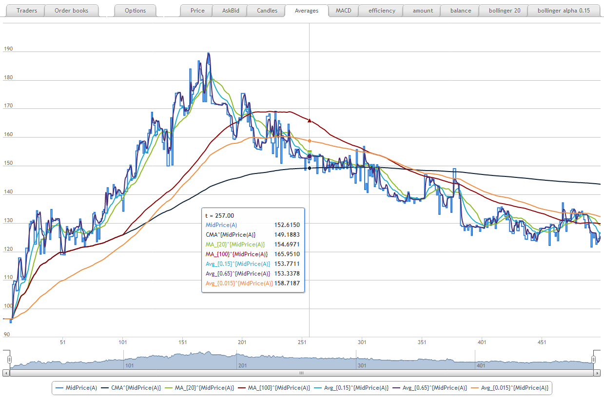
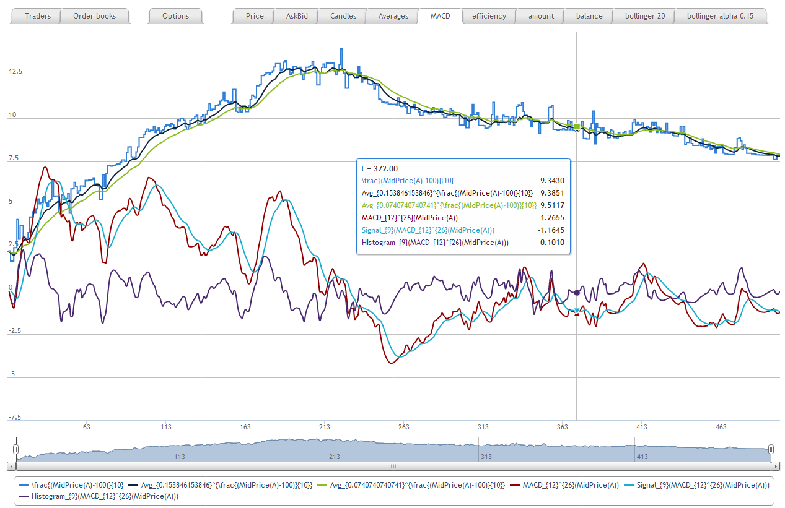
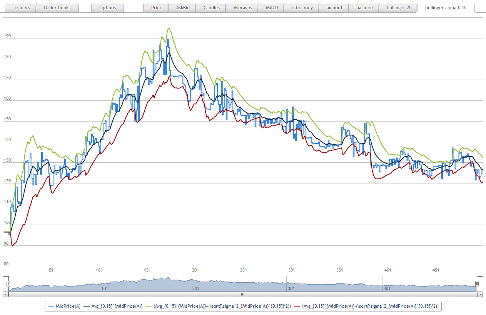
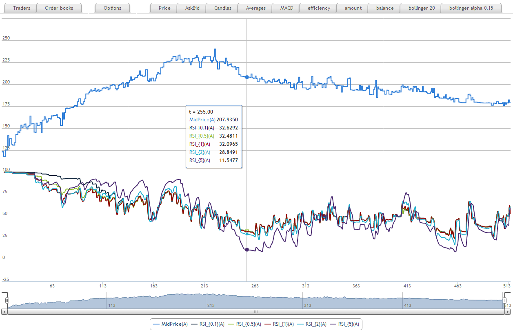
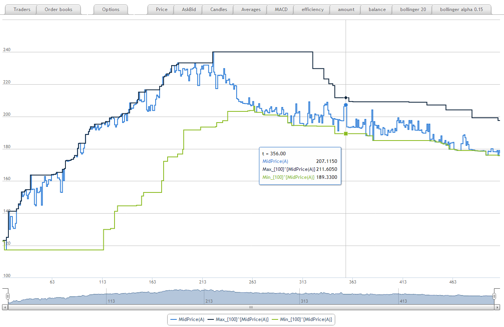

Statistics
==========

Statistical functions operate on paths of function values and in general case it requires storing the function history and recalculating statistics each time. Every recalculation has at least O(M) time complexity where M is number of points involved and thus it is quite time consuming. 

Many statistical packages (like `pandas <http://pandas.pydata.org/>`_ and `ta-lib <http://ta-lib.org/>`_) provide a lot of useful functions that work on time series and in order to facilate interoperability with these libraries the market simulator provide handful adapters. 

In some cases (moving average, moving variance etc) it is possible to introduce an incremental version that make every update in constant time and thus works much faster.  

.. contents::
    :local:
    :depth: 1
    :backlinks: none

Moving average
--------------
 
- cumulative: ``CMA``
- simple moving: ``MA(timeframe)``
- exponentially weighted: ``EWMA(alpha)``

Moving average convergence/divergence
-------------------------------------

Having defined moving average we may introduce `moving average convergence/divergence <http://en.wikipedia.org/wiki/MACD>`_, its signal and histogram

.. code-block:: haskell

	MACD(x, slow, fast) ::= EWMA(x, 2./(fast+1)) - EWMA(x, 2./(slow+1))
	MACD_signal(x, slow, fast, timeframe) ::= EWMA(MACD(x, slow, fast), 2/(timeframe+1))
	MACD_histogram(x, slow, fast, timeframe) ::= MACD(x,slow,fast) - MACD_signal(x,slow, fast, timeframe)

Moving variance
---------------

- cumulative: ``Variance``
- moving: ``MovingVariance(timeframe)``
- exponentially weighted: ``EWMV(alpha)``

Variances could be implemented via Mean but it looses precision so they are implemented as simple modules 

.. code-block:: haskell

	Var(x) ::= Mean(Sqr(x)) - Sqr(Mean(x)) 

Standard deviation 
------------------

.. code-block:: haskell

	StdDev(x) ::= Sqrt(Variance(x))
	StdDevRolling(x, timeframe) ::= Sqrt(MovingVariance(x, timeframe))
	StdDevEW(x, alpha) ::= Sqrt(EWMV(x, alpha))

Bollinger bands
---------------

Having moving averages and variances it is possible to find `bollinger bands <http://en.wikipedia.org/wiki/Bollinger_Bands>`_:

.. code-block:: haskell

	Bollinger_Hi(x) ::= Mean(x) + 2*StdDev(x)
	Bollinger_Lo(x) ::= Mean(x) - 2*StdDev(x)

Relative strength index
-----------------------

An observable returning values of a function with some lag (``Lagged``) allows easily implement `relative strength index <http://en.wikipedia.org/wiki/Relative_strength_index>`_: 

.. code-block:: haskell

	Ups(x, dt, alpha) ::= EWMA(max(0, x - Lagged(x, dt)), alpha) --- moving average of positive movements
	Downs(x, dt, alpha) ::= EWMA(max(0, Lagged(x, dt) - x), alpha) --- moving average of negative movements
	RSI(x, dt, alpha) ::= 100 - 100 / (1 + Ups(x,dt,alpha)/Downs(x,dt,alpha))

Moving minimum and maximum
--------------------------

