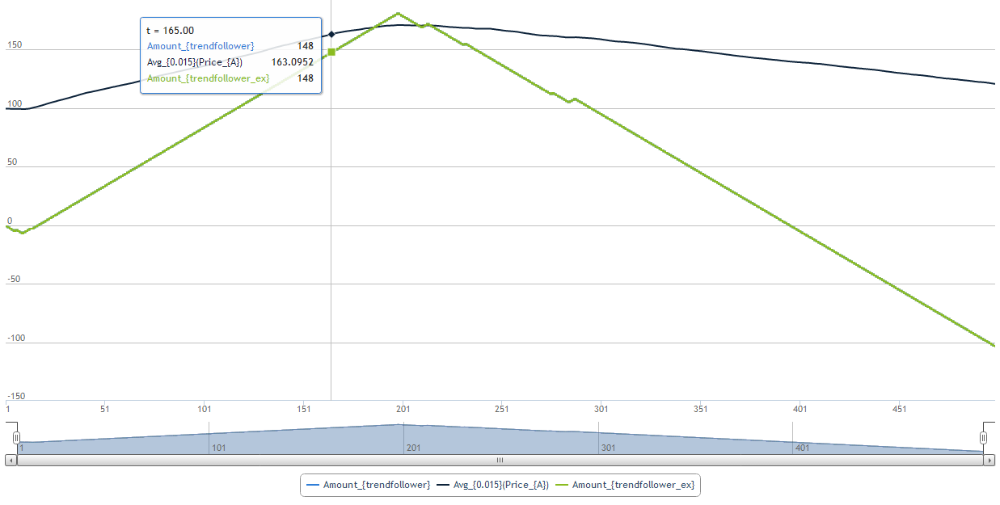

Simple strategies
=================

.. contents::
    :local:
    :depth: 2
    :backlinks: none
    
``Generic(eventGen, orderFactory)`` wakes up at moments of time given by ``eventGen`` and asks ``orderFactory`` to create an order

For example, a crossing averages strategy that sends market orders with exponentially distributed volume sizes in even intervals of time could be written as:

.. code-block:: python

    strategy.Generic(event.Every(constant(1.)),
            order.factory.Market(
                side = parts.side.TwoAverages(
                                    MidPrice(orderbook.OfTrader()), 
                                    alpha1, alpha2),
                volume = rnd.Expovariate(1.)
           ))

There are also handy specialisations of the generic strategy.

Usually they accept parameters defining strategy logic and an order factory in a curried form.

Noise strategy
--------------

Noise strategy wakes up at moments of time given by ``eventGen`` and chooses randomly trade side. 

.. code-block:: haskell

    side.Random() ::= if uniform(0,1) > 0.5 then Side.Sell else Side.Buy
    
    strategy.Noise(eventGen, orderFactory) ::= 
    	Generic(eventGen, orderFactory(side.Random()))
    
Signal strategy
---------------

.. code-block:: haskell

    side.Signal(x, threshold) ::= if  x > threshold then Side.Buy else 
                                  if -x > threshold then Side.Sell else
                                     None 
	
	strategy.Signal(eventGen, orderFactory, signal, threshold) ::= 
		strategy.Generic(eventGen, orderFactory(side.Signal(signal, threshold)))
												
.. image:: Figures/web/signal.png

Trend follower
--------------

.. code-block:: haskell

    side.TrendFollower(price, alpha) ::= side.Signal(Derivative(EWMA(price, alpha)), 0)
    
    strategy.TrendFollower(eventGen, orderFactory, alpha) ::= 
    	strategy.Generic(eventGen, orderFactory(
    		side.TrendFollower(observable.MidPrice(), alpha)))

Crossing averages strategy
--------------------------

.. code-block:: haskell

    side.TwoAverages(price, alpha1, alpha2) ::= side.Signal(EWMA(price, alpha1) - 
    														EWMA(price, alpha2), 0)

	strategy.TwoAverages(eventGen, orderFactory, alpha1, alpha2) ::= 
		strategy.Generic(eventGen, orderFactory(
			side.TwoAverages(observable.MidPrice(), alpha1, alpha2)))
			
.. image:: Figures/web/twoaverages.png

Fundamental value strategy
--------------------------

.. code-block:: haskell

    side.FundamentalValue(orderbook, fv) ::= if BestPrice(Asks(orderbook)) < fv then Side.Buy else 
                                             if BestPrice(Bids(orderbook)) > fv then Side.Sell else
                                             Nothing
                                             
    strategy.FundamentalValue(eventGen, orderFactory, fv) ::= 
		strategy.Generic(eventGen, orderFactory(
			side.FundamentalValue(orderbook.OfTrader(), fv)))
			
.. image:: Figures/web/fundamentalvalue.png

Mean reverting strategy
-----------------------

.. code-block:: haskell

    side.MeanReverting(orderbook, alpha) ::= side.FundamentalValue(orderbook, 
    											EWMA(MidPrice(orderbook), alpha))
    											
  	strategy.MeanReverting(eventGen, orderFactory, alpha) ::=
  		strategy.Generic(eventGen, orderFactory, 
  			side.MeanReverting(orderbook.OfTrader(), alpha))

.. image:: Figures/web/meanreversion.png

Dependency trading strategy
---------------------------

.. code-block:: haskell

    side.Dependency(orderbook, otherOrderbook, factor) ::= 
    	side.FundamentalValue(orderbook, MidPrice(otherOrderbook) * factor)
    	
    strategy.Dependency(eventGen, orderFactory, otherOrderBook, factor) ::=
    	strategy.Generic(eventGen, orderFactory(
    		side.Dependency(orderbook.OfTrader(), otherOrderBook, factor)))

.. image:: Figures/web/dependency.png
    		
  
